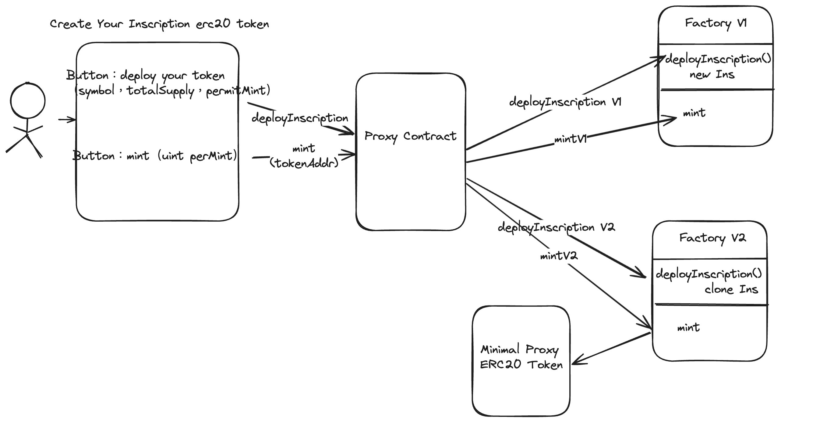

# Upgradable Inscription Factory Contracts

## Prototype



## Contract Addresses

- UUPS Proxy : https://sepolia.etherscan.io/address/0x578e343abe891a8b4144358a1572a5775aa95116#code
- InscriptionFactoryV1 (Implementation): https://sepolia.etherscan.io/address/0x704aeb55476b303e3d3c142d48bbf374dce1eb3c#code
- InscriptionFactoryV2 (Implementation): https://sepolia.etherscan.io/address/0x92ce697bf55cb94b469089fae16b85a5e614887a#code
- InscriptionToken for Minial Proxy Contract: https://sepolia.etherscan.io/address/0xa628d2048c0e832a492ff9a3cb9d5a701828acac#code

### User Action

- Deploy token tx: https://sepolia.etherscan.io/tx/0xaf5daaa73ddfd057671a54cdd57d1ff3651470d0a99ee017ab85a8ce538d19b2
- Deployed Inscription Token:
  https://sepolia.etherscan.io/token/0x42a8dd860b1b54ef3c6de228571b1aca76df10fb?a=0x578e343abe891a8b4144358a1572a5775aa95116#code
- Mint by user paid with price tx:
  https://sepolia.etherscan.io/tx/0x15225c683ba5296068c84f9c405b5ba784f7d06cf526706c58a2d277d2385f5d

## Deployment Steps

1. Deploy `Token factory V1 and UUPS porxy` use below bash command:

```bash
bash ./script/deploy.sh --file ./script/DeployUUPSTokenFactoryV1.s.sol --account <your-keystore-account>
```

2. Upgrade to `InscriptionFactoryV2` using the proxy address

```bash
bash ./script/deploy.sh --file ./script/DeployUUPSTokenFactoryV2.s.sol --account <your-keystore-account>
```

## Tests

```bash
forge clean && forge test -vvvv --match-path ./test/Upgradable/UUPSTokenFactory.t.sol
```
